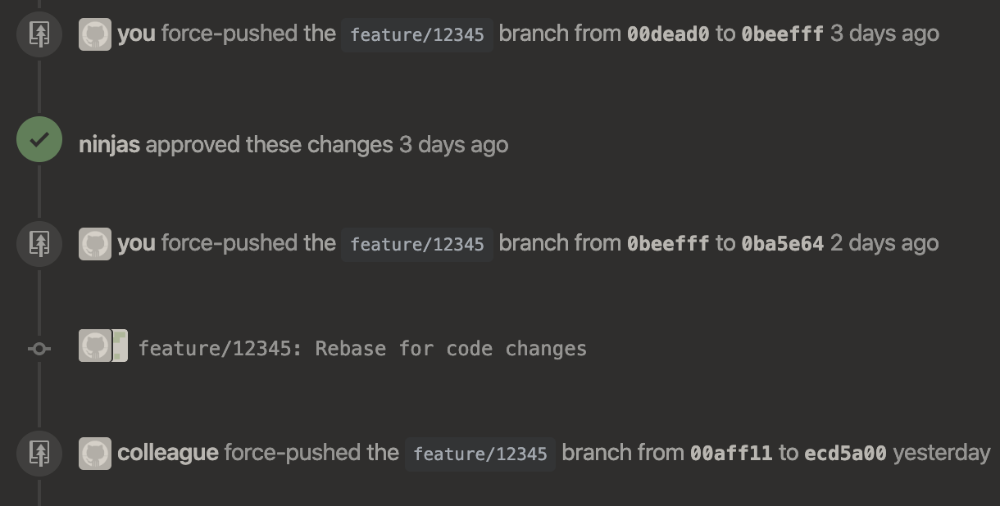

# prebase

Use prebase if:
- Your code wants to merge and spread to other branches
- You want to help it ~mutate~ adjust to the latest develop branch quickly and efficiently
- You want to see which part of which commit is ~infecting~ inflicting troubles and ~symptoms~ merge issues

If many branches touch the same parts of a module (or component), *prebase* the code to *pro*actively _isolate_ (extract and abstract) that part of the code. This is a call for preemptive code hygiene ;-)

## Background

Use the force, and push often.

Is your history is filling up, like this

and it's taking up a lot of your time?

There's an app for that! Or... will be, if this projects gets built...
